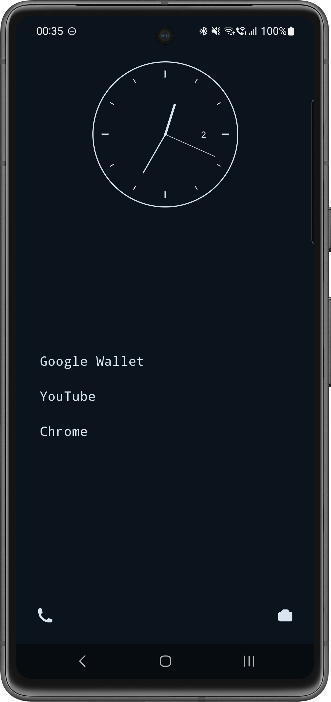
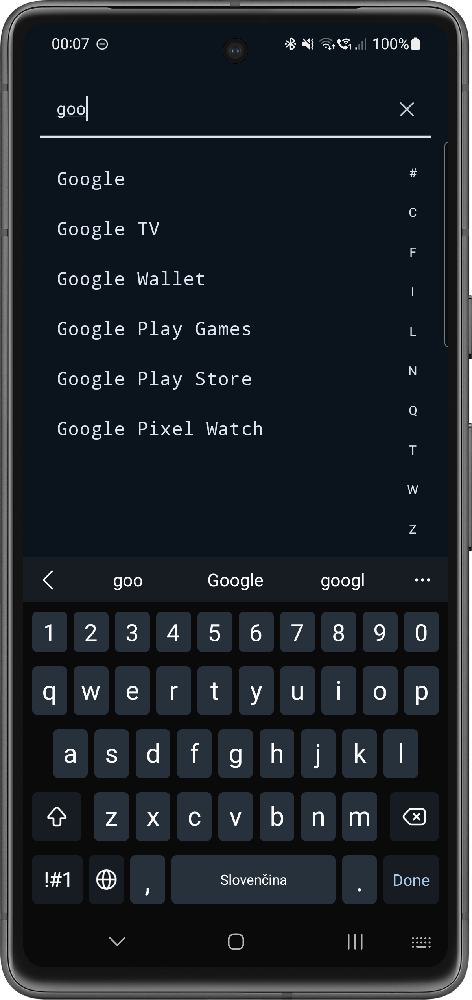
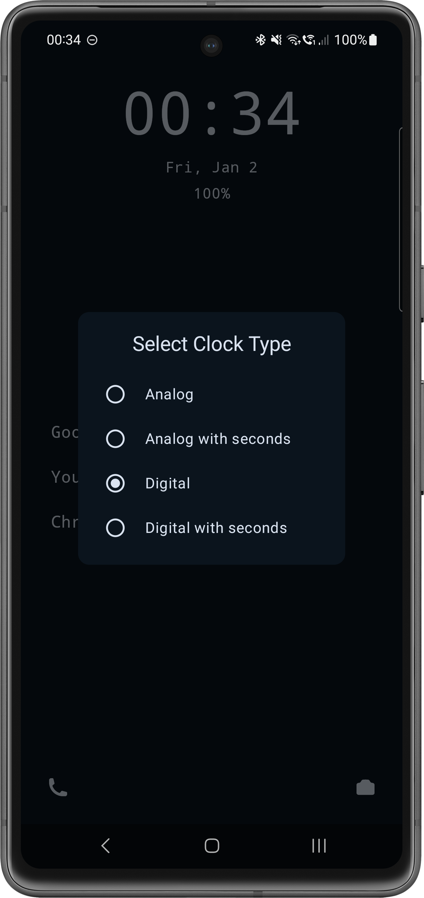
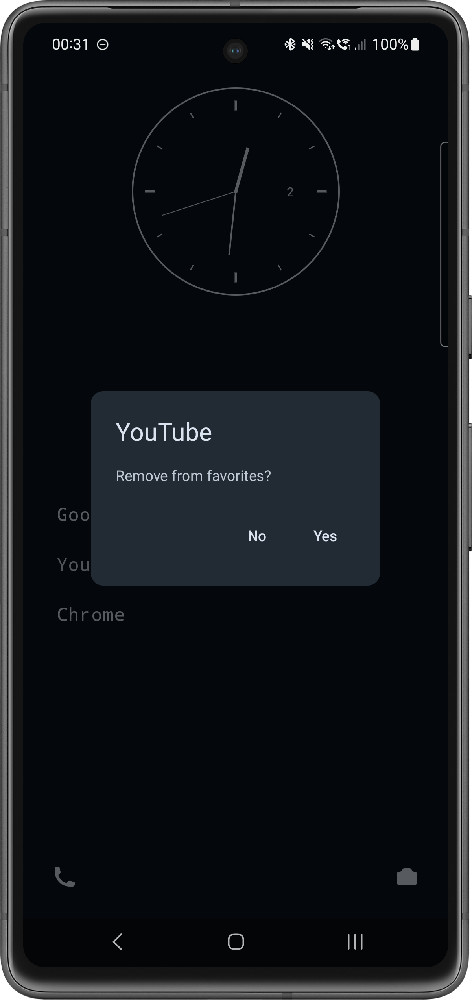

# 📱 CleanPhoneLauncher

<p align="center">
  
</p>

<p align="center">
  <strong>A minimalist Android launcher for a calmer digital life</strong>
</p>

<p align="center">
  <a href="https://github.com/RikoAppDev/CleanPhoneLauncher/releases"></a>
  <a href="https://github.com/RikoAppDev/CleanPhoneLauncher/actions"></a>
  
  
  
</p>

---

## ✨ Features

- 🎯 **Minimalist design** - Clean interface without distracting elements
- ⏰ **Customizable clock** - Choose between analog and digital clock
- ⭐ **Favorite apps** - Quick access to your most used applications
- 📱 **Quick shortcuts** - Phone and camera always within reach
- 🔋 **Battery display** - Battery status overview right on the home screen
- 🌙 **Dark mode** - Automatic dark mode support
- 🚀 **Fast and smooth** - Optimized for the best performance

## 📸 Screenshots

<p align="center">
  
  
  
  
</p>

| Home Screen | App List | Clock Settings | Remove |
|:-----------:|:--------:|:--------------:|:------:|
| Main screen with clock and favorites | Complete list of installed apps | Clock type selection | Manage favorite apps |

## 🏗️ Architecture

The project uses **Clean Architecture** with **MVI (Model-View-Intent)** pattern:

```
app/src/main/java/dev/rikoapp/cleanphonelauncher/
│
├── 📁 data/                              # Data layer
│   ├── 📁 database/                      # Room database
│   │   ├── 📁 dao/
│   │   │   └── FavoriteAppDao.kt         # Data Access Object
│   │   ├── 📁 di/
│   │   │   └── DatabaseModule.kt         # Koin DI module for database
│   │   ├── 📁 entities/
│   │   │   └── FavoriteAppEntity.kt      # Database entity
│   │   ├── 📁 mappers/
│   │   │   └── FavoriteAppMapper.kt      # Entity to domain mapper
│   │   └── CleanPhoneLauncherDatabase.kt # Room database
│   ├── 📁 di/
│   │   └── DataModule.kt                 # Koin DI module for data
│   ├── ClockRepositoryImpl.kt            # Clock repository implementation
│   ├── InstalledAppsRepositoryImpl.kt    # Installed apps repository implementation
│   ├── RecentAppsRepositoryImpl.kt       # Recent apps repository implementation
│   └── RoomLocalFavoriteAppDataSource.kt # Favorite apps data source implementation
│
├── 📁 di/                                # Dependency Injection
│   └── AppModule.kt                      # Main Koin module
│
├── 📁 domain/                            # Domain layer
│   ├── 📁 model/                         # Domain models
│   │   ├── AppData.kt                    # Application data model
│   │   └── FavoriteApp.kt                # Favorite app model
│   ├── ClockRepository.kt                # Clock repository interface
│   ├── InstalledAppsRepository.kt        # Installed apps repository interface
│   ├── LocalFavoriteAppDataSource.kt     # Favorite apps data source interface
│   └── RecentAppsRepository.kt           # Recent apps repository interface
│
├── 📁 presentation/                      # Presentation layer (MVI)
│   ├── 📁 applist/                       # App list feature (MVI)
│   │   ├── AppListScreen.kt              # UI (View)
│   │   ├── AppListScreenAction.kt        # User actions (Intent)
│   │   ├── AppListScreenState.kt         # UI state (Model)
│   │   └── AppListViewModel.kt           # State management
│   ├── 📁 home/                          # Home feature (MVI)
│   │   ├── HomeScreen.kt                 # UI (View)
│   │   ├── HomeScreenAction.kt           # User actions (Intent)
│   │   ├── HomeScreenState.kt            # UI state (Model)
│   │   └── HomeViewModel.kt              # State management
│   ├── 📁 components/                    # Reusable UI components
│   │   ├── AnalogClock.kt                # Analog clock
│   │   ├── AppListItem.kt                # App list item
│   │   ├── ClockTypeDialog.kt            # Clock selection dialog
│   │   ├── DigitalClock.kt               # Digital clock
│   │   └── FavoriteDialog.kt             # Favorites dialog
│   ├── 📁 model/                         # Presentation models
│   │   └── ClockType.kt                  # Clock type enum
│   ├── 📁 di/
│   │   └── PresentationModule.kt         # Koin DI module for presentation
│   ├── 📁 ui/
│   │   └── 📁 theme/                     # Material 3 theme
│   │       ├── Icon.kt                   # Icons
│   │       ├── Theme.kt                  # Colors and themes
│   │       └── Type.kt                   # Typography
│   └── LauncherPager.kt                  # ViewPager for navigation
│
├── MainActivity.kt                       # Main activity
└── MainApplication.kt                    # Application class with Koin
```

### Architecture Layers (MVI)

```
+---------------------------------------------------------------+
|                      PRESENTATION (MVI)                       |
|                                                               |
|    +----------+      +------------+      +-------------+      |
|    |  Screen  |      |  ViewModel |      |    State    |      |
|    |  (View)  |      |            |      |   Action    |      |
|    +----+-----+      +------+-----+      +------+------+      |
|         |                   |                   |             |
|         |    User Action    |                   |             |
|         |------------------>|   Process Action  |             |
|         |                   |------------------>|             |
|         |                   |                   |             |
|         |                   |<------------------|             |
|         |<------------------|    New State      |             |
|         |   Render UI       |                   |             |
|                                                               |
+-------------------------------+-------------------------------+
                                |
+-------------------------------v-------------------------------+
|                            DOMAIN                             |
|      +-------------------+    +-------------------------+     |
|      |  Models (AppData) |    | Interfaces (Repository) |     |
|      +-------------------+    +-------------------------+     |
+------------------------------+--------------------------------+
                               |
+------------------------------v--------------------------------+
|                            DATA                               |
|       +-------------+  +-------------+  +-------------+       |
|       |    Room     |  |    DAOs     |  |  Entities   |       |
|       +-------------+  +-------------+  +-------------+       |
|                    +---------------------+                    |
|                    |  RepositoryImpl(s)  |                    |
|                    +---------------------+                    |
+---------------------------------------------------------------+
```

## 🛠️ Tech Stack

| Technology | Usage |
|------------|-------|
| **Kotlin 2.3** | Main programming language |
| **Jetpack Compose** | Modern declarative UI |
| **Material 3** | Design system |
| **Room** | Local SQLite database |
| **Koin** | Dependency Injection |
| **Coroutines & Flow** | Asynchronous operations |
| **ViewModel** | UI state management |

## 📋 Requirements

- **Android 13** (API 33) or higher
- **Android Studio** Ladybug or newer

## 🚀 Installation

### From GitHub Releases

1. Go to [Releases](https://github.com/RikoAppDev/CleanPhoneLauncher/releases)
2. Download the latest `CleanPhoneLauncher-vX.X.X.apk`
3. Install the APK on your device

### Build from Source

```bash
# Clone the repository
git clone https://github.com/RikoAppDev/CleanPhoneLauncher.git

# Navigate to the folder
cd CleanPhoneLauncher

# Build debug version
./gradlew assembleDebug

# Find APK at: app/build/outputs/apk/debug/
```

## 🔧 Development

### Running the Project

1. Open the project in Android Studio
2. Sync Gradle
3. Run on emulator or physical device

### Branch Structure

- `main` - Stable production version
- `develop` - Development branch

### Commit Conventions

The project uses [Conventional Commits](https://www.conventionalcommits.org/):

```bash
feat: add new feature           # → Minor version (1.0.0 → 1.1.0)
fix: fix a bug                  # → Patch version (1.0.0 → 1.0.1)
feat!: breaking change          # → Major version (1.0.0 → 2.0.0)
```

## 🔄 CI/CD

The project has a fully automated CI/CD pipeline:

- ✅ **Automatic builds** on every push to main
- ✅ **Automatic versioning** based on commit messages
- ✅ **Automatic GitHub Releases** with APK and AAB
- ✅ **Lint checks and tests** on every PR
- 🔮 **Play Store deployment** (ready to activate)

More information in [CI_CD_SETUP.md](.github/CI_CD_SETUP.md).

## 📁 Project File Structure

```
CleanPhoneLauncher/
├── 📁 .github/
│   ├── 📁 workflows/
│   │   ├── ci.yml              # Continuous Integration
│   │   └── release.yml         # Build & Release
│   └── CI_CD_SETUP.md          # CI/CD documentation
├── 📁 app/
│   ├── 📁 src/
│   │   ├── 📁 main/
│   │   │   ├── 📁 java/        # Kotlin source files
│   │   │   └── 📁 res/         # Resources (layouts, strings, ...)
│   │   ├── 📁 test/            # Unit tests
│   │   └── 📁 androidTest/     # Instrumentation tests
│   └── build.gradle.kts
├── 📁 docs/
│   └── 📁 screenshots/         # App screenshots
├── 📁 gradle/
│   └── libs.versions.toml      # Version catalog
├── build.gradle.kts
├── LICENSE
└── README.md
```

## 🤝 Contributing

Contributions are welcome! Please:

1. Fork the repository
2. Create a feature branch (`git checkout -b feature/amazing-feature`)
3. Commit your changes (`git commit -m 'feat: add amazing feature'`)
4. Push to the branch (`git push origin feature/amazing-feature`)
5. Open a Pull Request

## 📄 License

This project is licensed under the [MIT License](LICENSE).

## 👨‍💻 Author

**RikoAppDev** - [GitHub](https://github.com/RikoAppDev)

---

<p align="center">
  Made with ❤️ and Kotlin
</p>

